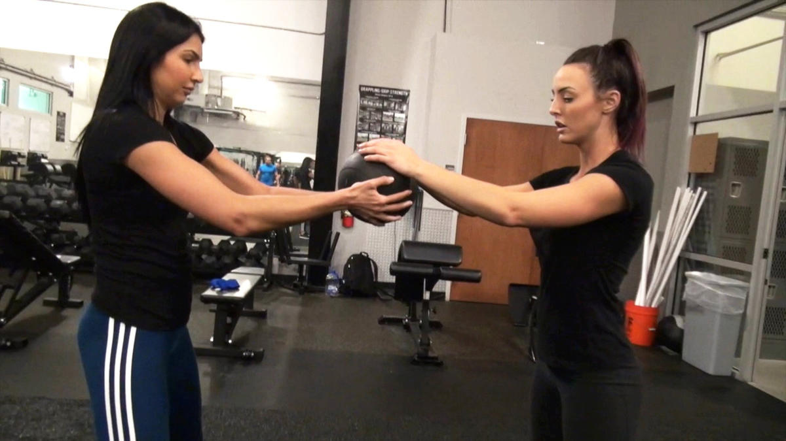
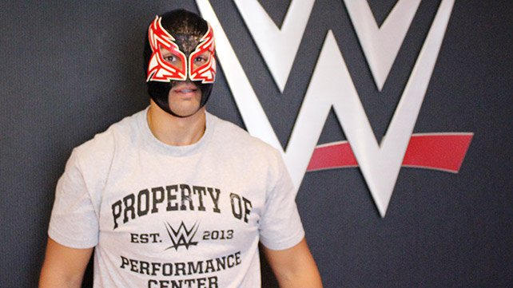
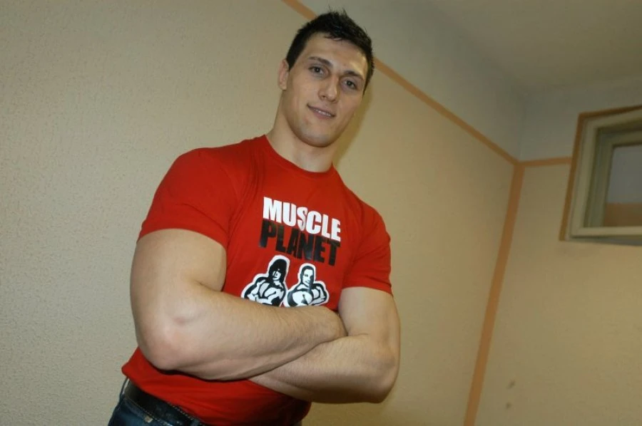
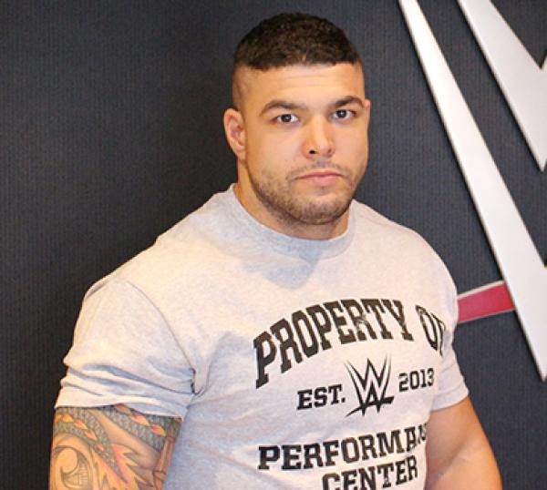
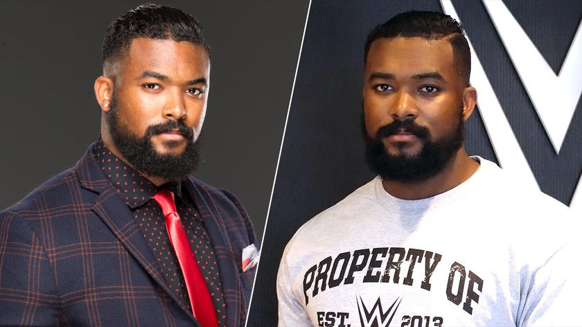
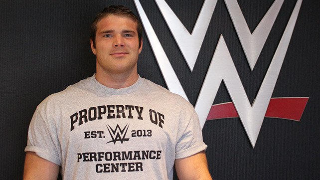
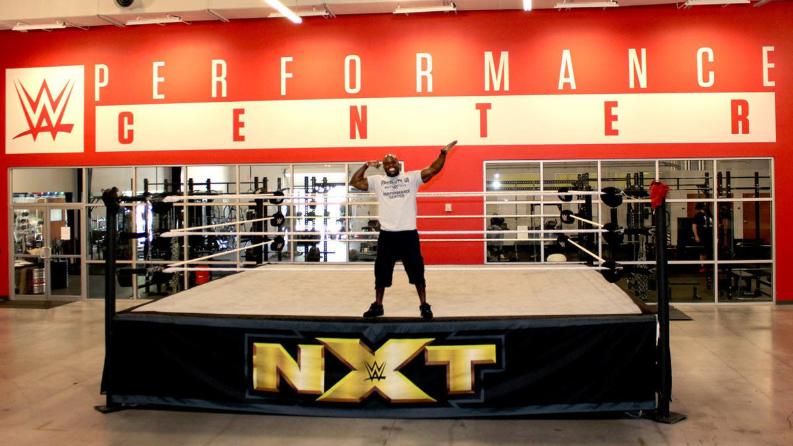
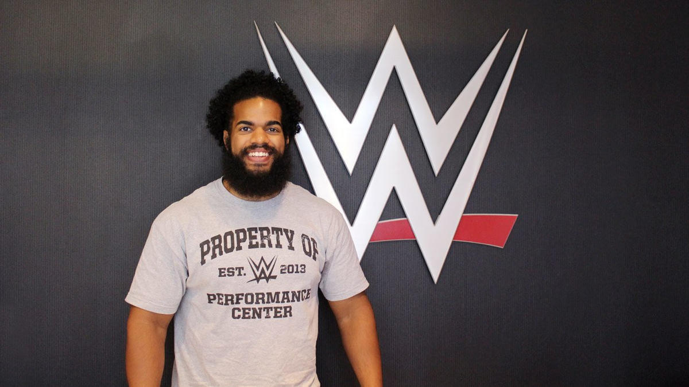

The WWE was actively recruiting, globally, for the April 2015 Performance Center class. Some made it to the main WWE roster and are still active, some achieved main roster superstardom and succeeded outside of WWE, while others didn't make it beyond NXT. Let's break down the WWE Performance Center class of 2015 and see what they are up to today (2023).

## 🇦🇺 Australia

### Cassie McIntosh aka Peyton Royce aka Cassie Lee (Born in Sydney, resided in Melbourne, Australia)

Cassie McIntosh got her pro wrestling training with [Pro Wrestling Australia](https://www.prowrestlingaustralia.com.au) in 2009 and also trained with Lance Storm at his now defunct academy, in 2012. 

She got her spot in the 2015 WWE Performance Center class after a WWE tryout was held in Australia in 2014. Cassie, going under the name Peyton Royce in the WWE, would compete in NXT from 2015 to 2018 before being called up to the main roster.

She was released from the WWE in 2021, along with her IIconics tag team partner, Jessica McKay. They both appeared on Impact! Wrestling later that year. She performed under the name Cassie Lee as one half of the IInspiration.

She is currently taking time away to care for her newborn with AEW superstar, Shawn Spears.
Status: Inactive

### Jessica McKay aka Billie Kay (Sydney, Australia)
Since 2008, has trained with the Pro Wrestling Alliance in Sydney, as well as Ring of Honor.
Jessica McKay also trained with Pro Wrestling Alliance and started her journey in 2007. In 2008, she made the excursion to the United States for independent promotions: CZW, ROH, Chikara, Shimmer, and Shine.

She received a spot in the 2015 WWE Performance Center class after a WWE tryout was held in Australia in 2014. Jessica, going under the name Billie Kay in the WWE, would compete in NXT from 2015 to 2018 before being called up to the main roster. Jessica, along with Cassie, were both released from their WWE contracts in 2021. She made a brief appearance with her IIconics partner at Impact! wrestling in late 2021.

She is currently modeling and acting, per her Instagram.
Status: Inactive

## 🇨🇦 Canada 

### Nhooph Al-Areebi Aka Aliyah (Toronto, Ontario, Canada)

Nhooph Al-Areebi started her pro wrestling training with Squared Circle in 2011. Her background is in acrobatics where she learned her skills at the Toronto Circus School from 2008-2012.

She received a spot in the 2015 WWE Performance Center class and would perform under her real name until January 2016. She made her WWE main roster debut in 2021 for the Smackdown brand.

She is currently on the WWE Smackdown roster but hasn't been used for quite a while.
Status: Active (WWE)

## 🇩🇪 Germany

### Axel Tischer Aka Alexander Wolfe (Dresden, Germany) 
Trained with GWF Wrestling in Berlin, Germany, since 2006. Served in the German Army from 2005-2007, achieving the rank of Private First Class.

Axel Tischer was trained in 2004 at the GWF (German Wrestling Federation) school and has wrestled all over Germany and Europe before joining the PC. From 2005-2007, he served in the German Army and achieved rank of Private First Class.

Axel was given a spot in the 2015 WWE Performance Center class. He made his debut in the same year for NXT. He would go under the name Alexander Wolfe in 2016 and joined the stable, SAnitY. Having success with the group, he was called up to the main roster for Smackdown in 2018 and wrestled for them until 2019 when he was reassigned to NXT UK. He was released from his WWE contract in May of 2021.

Axel Tischer can be seen on the independent scene in Germany, Europe, and the United States.
Status: Active (Independents)

## 🇲🇽 Mexico

### Oscar Vasquez Aka Magno (Ciudad Juarez, Mexico) 
Oscar Vasquez trained in Juarez in the lucha libre style of wrestling by Hector Rincon, who was the childhood friend of the late, Eddie Guerrero

Oscar accepted his 2015 WWE Performance Center spot in April and [cagematch.net](https://www.cagematch.net/?id=2&nr=5334&page=4) lists his NXT house show matches in 2015 and 2016.

It's assumed he was released in 2016 based on his match history. He has been performing for Lucha Libre Elite and various independent promotions in the United States in Mexico.

Oscar aka Magno's status in the industry is unknown.
Status: Unknown (last match documented was from May 5, 2022 for Lucha VaVoom)

## 🇷🇸 Serbia

Radomir Petkovic Aka King Constantine from Belgrade, Serbia was a two-time Greco-Roman and Freestyle bronze medalist at the 2009 Mediterranean Games and also a 2010 European Wrestling Champion. 

He trained with the WWE Performance Center in 2015 and was released a year later.

Status: Inactive

## 🇬🇧 United Kingdom

### Peter Howard (Exeter, England)
Played collegiate Rugby in the U.K. and was a regional discus champion.

## 🇺🇸 United States of America

### Kenneth Crawford Aka Montez Ford (Chicago, Illinois/Anson County, North Carolina) 
Served in the U.S. Marine Corps for four years and accumulated a perfect 300 score in the United States Marine Corps Physical Fitness Test. Holds the North Carolina South Piedmont and Anson High School records in the 200-meter, 400-meter and 4x4 relay. Anson High School Athlete of the Year in 2007.

### Thomas Kingdon (Traverse City, Michigan)
Competed in amateur bodybuilding and won the super-heavyweight class at the 2013 NPC Central States Competition.

### Sesugh Uhaa Aka Apollo Crews (Atlanta, Georgia)
High school soccer, football and track-and-field star. Began training in 2009 and competed for Dragon Gate USA. Nigerian descent.

### Levis Valenzuela Jr. (Durham, North Carolina) 
Trained with CWF Mid-Atlantic in 2013. Proficient in dance and won various awards for collegiate ballroom dancing. Holds a Bachelor of Arts in Criminal Justice from UNC Charlotte. Grew up in the United States, lived in South Korea from 2011-2013, and speaks Spanish.

[Article published on 13.04.2015](https://www.wwe.com/shows/wwenxt/wwe-performance-center-welcomes-new-class-of-recruits)