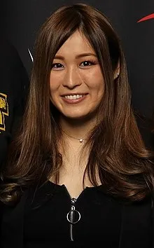
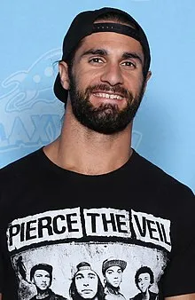

In [part 1 of Superstars Background Breakdown: WWE Superstars who competed at Backlash 2023](), we took a look at the WWE superstars who had collegiate athletic backgrounds before joining World Wrestling Entertainment. In part 2, we'll showcase the superstars who started their careers on the independents before becoming superstars in the WWE.

There were a total of 19 professional wrestlers that performed on the WWE premium live event that had different backgrounds before joining the main roster. 

## Superstars who got their start in independent wrestling before joining WWE
**52.6%** of the performers (10 out of 19) from WWE Backlash 2023 had indy wrestling backgrounds.  

### Iyo Sky (also performed as Io Shirai)
 

Iyo Sky / Io Shirai, whose real name is Masami Odate, is a highly accomplished Japanese professional wrestler. Before joining WWE, Shirai had an impressive career in various promotions in Japan, where she established herself as one of the most talented and charismatic performers in women's wrestling.

Shirai began her wrestling journey in 2007 when she joined the Japanese promotion Stardom, known for its focus on women's wrestling. Under the Stardom banner, she quickly rose through the ranks and became one of the promotion's top stars. Shirai's in-ring style combined high-flying maneuvers, technical prowess, and a fearless attitude, captivating audiences around the world.

During her time in Stardom, Shirai held numerous championships, including the World of Stardom Championship and the Wonder of Stardom Championship, solidifying her status as a dominant force in the promotion. She engaged in memorable rivalries and delivered exceptional matches against notable opponents.

Shirai's reputation extended beyond Stardom, as she also competed in other Japanese promotions like Pro Wrestling Wave and Sendai Girls' Pro Wrestling. Her performances in these promotions showcased her versatility and adaptability as a wrestler.

In 2018, Io Shirai signed with WWE and joined the NXT brand, marking her transition to the global stage. She made an immediate impact and quickly became a fan favorite with her incredible athleticism and captivating in-ring presence. Shirai's tenure in WWE's NXT has been highlighted by her reign as the NXT Women's Champion and her involvement in compelling storylines and matches against top competitors.

Io Shirai's background in Japanese wrestling and her remarkable achievements prior to joining WWE have undoubtedly contributed to her success in the company. Her journey from Stardom to NXT has solidified her position as one of the premier female wrestlers in the world and continues to inspire fans with her exceptional skills and passion for the sport.

### Seth Rollins (also performed as Tyler Black)

Colby Lopez, famously known by his ring name Seth Rollins, had a remarkable professional wrestling career before making his way to WWE. Trained by Danny Daniels at the Midwest Wrestling Academy, Rollins quickly proved himself as a standout talent.

Rollins began his journey in various independent promotions, most notably Ring of Honor (ROH). Under the name Tyler Black, he became a prominent figure in ROH, captivating audiences with his high-energy style and impressive aerial maneuvers. Black's time in ROH saw him engage in thrilling rivalries and deliver outstanding matches against some of the industry's top stars.

During his tenure in ROH, Black formed a partnership with Jimmy Jacobs and later joined The Age of the Fall stable, which showcased his ability to excel as both a singles competitor and a team player. His performances in ROH earned him accolades and recognition, solidifying his reputation as one of the most exciting talents on the independent wrestling scene.

In 2010, Seth Rollins made his much-anticipated debut in WWE, initially as a member of The Shield alongside Dean Ambrose and Roman Reigns. The group's impact was immediate and profound, as they disrupted the status quo and asserted their dominance over the WWE landscape.

Rollins' WWE career has been nothing short of stellar. His natural athleticism, technical prowess, and charismatic presence quickly endeared him to fans and critics alike. As Seth Rollins, he has achieved numerous milestones in WWE, including winning the Money in the Bank contract and becoming a Grand Slam Champion by capturing the WWE Championship, Universal Championship, Intercontinental Championship, and Tag Team Championship.

### Austin Theory

Austin Theory, whose real name is Austin White, boasts a diverse background that contributed to his rise in professional wrestling before joining WWE. Prior to stepping into the squared circle, Theory established himself as an accomplished bodybuilder.

Theory's journey began in the world of bodybuilding, where he dedicated himself to sculpting a remarkable physique. His commitment to the sport led him to achieve significant success, showcasing his discipline, dedication, and determination to push his physical limits.

Transitioning from bodybuilding to professional wrestling, Theory trained under influential mentors such as AR Fox and Mr. Hughes, who honed his skills and shaped his in-ring style. With their guidance, Theory developed a unique blend of athleticism, technical prowess, and showmanship that would serve as the foundation for his wrestling career.

Theory's early wrestling days saw him competing in various independent promotions, including EVOLVE and Full Impact Pro (FIP). He quickly caught the attention of wrestling enthusiasts with his impressive in-ring abilities, charismatic presence, and natural aptitude for storytelling inside the ring.

Theory's breakout moment arrived in 2019 when he signed with WWE and joined the NXT brand. His debut in NXT showcased his potential, as he delivered captivating performances against established stars and rising talents alike. Theory's athleticism, combined with his growing mastery of wrestling techniques, made him an exciting prospect within WWE's developmental system.

Throughout his tenure in NXT, Theory continued to evolve and refine his craft, gaining valuable experience while engaging in intense rivalries and participating in high-stakes matches. His ability to adapt to different styles and connect with audiences through his charisma and in-ring performance further solidified his position as a rising star in WWE.

While his bodybuilding background laid the foundation for his physical prowess, Austin Theory's dedication to honing his wrestling skills and his captivating presence inside the ring set him apart. His journey from bodybuilding to professional wrestling demonstrates his commitment to pursuing his passion and making a name for himself in the industry.

### Bronson Reed (also performed as Jonah Rock)

Jonah Rock, also known as Bronson Reed, had a notable professional wrestling background prior to joining WWE. Hailing from Australia, Reed began his wrestling career in 2007 and quickly established himself as a formidable force in the industry.

One of the significant milestones in Reed's career came with his time in Pro Wrestling Noah, a renowned promotion based in Japan. During his tenure in Noah, Reed had the opportunity to face off against top-tier international talent and established himself as a standout performer in the Japanese wrestling scene. His matches were characterized by his hard-hitting offense, resilience, and an undeniable presence that captivated audiences.

In addition to his success in Japan, Reed made appearances for prominent independent wrestling promotions worldwide, including Pro Wrestling Guerrilla (PWG), Ring of Honor (ROH), and Progress Wrestling. These appearances allowed him to showcase his skills to a broader audience and solidify his reputation as a force to be reckoned with.

Reed's path eventually led him to WWE's developmental territory, NXT. He signed with WWE in 2019 and adopted the ring name Bronson Reed. Upon his debut in NXT, Reed made an immediate impact, impressing fans and critics alike with his unique combination of power moves, agility, and charisma. His dominant performances and memorable matches elevated his status within the brand, earning him opportunities to compete for championship gold.

### Zelina Vega (also performed as Rosita)

Zelina Vega, whose real name is Thea Megan Trinidad, had a diverse and dynamic professional wrestling background prior to joining WWE. Born and raised in Queens, New York, Vega's passion for wrestling began at a young age, and she embarked on a journey that led her to numerous promotions and notable accomplishments.

Vega's training in professional wrestling started at the tender age of 17 under the guidance of renowned veteran wrestler and trainer, Jay Lethal. She honed her skills and developed a deep understanding of the craft, setting the stage for her future success in the industry.

Her early career saw Vega compete in various independent promotions, where she demonstrated her exceptional athleticism, in-ring prowess, and captivating personality. She gained recognition for her high-energy performances and ability to engage the audience, which helped her stand out from the competition.

One of Vega's notable accomplishments before joining WWE was her time with Impact Wrestling, where she performed under the ring name "Rosita." As part of the tag team known as The Latin American Xchange (LAX), she captured the Impact Wrestling Knockouts Tag Team Championship alongside her partner, Sarita (Sarah Stock). This victory marked a significant milestone in Vega's career and solidified her reputation as a talented and accomplished wrestler.

Vega also made appearances in other notable promotions such as Ring of Honor (ROH) and Lucha Underground, where she continued to showcase her skills and leave a lasting impression on fans and critics alike. Her performances were characterized by her agility, quickness, and ability to tell a compelling story inside the ring.

In 2017, Vega's journey in the wrestling world brought her to WWE. She signed with the company and made her debut as a manager, accompanying Andrade "Cien" Almas to the ring. Vega's partnership with Almas showcased her exceptional mic skills, charisma, and ability to add a new dimension to the characters she worked with.

### Rhea Ripley (also performed as Demi Bennett)

Rhea Ripley, whose real name is Demi Bennett, has an impressive professional wrestling background that paved the way for her remarkable career in WWE. Hailing from Adelaide, Australia, Ripley's journey in wrestling began at a young age, fueled by her passion and determination to succeed in the industry.

Ripley's training in professional wrestling started in her teenage years under the guidance of the Riot City Wrestling (RCW) Academy in South Australia. There, she developed her skills and quickly caught the attention of the wrestling community with her natural athleticism and fierce in-ring presence.

In 2017, Ripley gained international recognition when she participated in the inaugural season of WWE's Mae Young Classic tournament. Despite being relatively new to the global stage, she left a lasting impression with her powerful strikes, technical ability, and commanding presence. Although she did not win the tournament, her performance showcased her potential and set the stage for her future endeavors.

Following her impressive showing in the Mae Young Classic, Ripley signed with WWE and joined the NXT UK brand, making her debut in the 2018 United Kingdom Championship Tournament. Her dominant presence and unique look quickly made her a standout competitor in the division. Inaugural NXT UK Women's Champion, Ripley showcased her intensity and brute strength, captivating audiences and proving herself to be a force to be reckoned with.

In 2019, Ripley made her transition to the main NXT brand, where she continued to make waves. Her fierce persona and fearless attitude propelled her to new heights as she feuded with some of the top female talents in NXT. Ripley's defining moment came at NXT TakeOver: WarGames in November 2019, where she led her team to victory and solidified her status as a rising star in the company.

### Damian Priest (also performed as Punishment Martinez)

Damian Priest, also known as Luis Martinez, boasts an impressive professional wrestling background that laid the foundation for his successful career in WWE. Hailing from New York City, Priest's journey in wrestling began with a desire to entertain and captivate audiences.

Priest began his training under the tutelage of renowned wrestling schools and trainers. He honed his skills at the Monster Factory, where he received guidance from the experienced coaches and learned the intricacies of the sport. With a natural athleticism and charisma, Priest quickly stood out from the crowd, catching the attention of wrestling promotions.

In 2015, Priest made his professional debut under the ring name Punishment Martinez. He started competing for various independent promotions, including Ring of Honor (ROH), where he made a significant impact. Throughout his tenure in ROH, Martinez showcased his unique blend of strength, agility, and striking ability, earning him a reputation as a formidable competitor.

Martinez's time in ROH was marked by notable feuds and memorable matches against some of the industry's top talents. He engaged in intense rivalries with wrestlers such as Jay White and Adam Page, delivering hard-hitting encounters that solidified his standing as a force to be reckoned with.

In 2018, Martinez secured a significant achievement in his career by winning the ROH Television Championship. This accomplishment served as a testament to his talent and hard work, further establishing him as a rising star in the industry. Martinez's reign as the Television Champion showcased his ability to connect with fans and deliver captivating performances on a consistent basis.

In 2019, Priest's impressive body of work caught the attention of WWE, and he signed with the company. Under the ring name Damian Priest, he made his debut on the NXT brand, bringing his unique presence and exciting in-ring style to a wider audience. Priest's combination of size, agility, and a hard-hitting offense made him an instant standout among the NXT roster.

Priest quickly rose through the ranks, engaging in memorable feuds and delivering standout performances in high-profile matches. His clashes with notable competitors like Finn Balor, Johnny Gargano, and Karrion Kross showcased his versatility and ability to adapt to different styles of wrestling.

### Kevin Owens (also performed as Kevin Steen)

Kevin Steen, known by his ring name Kevin Owens in WWE, has a storied professional wrestling background that laid the groundwork for his successful career in the industry. Hailing from Canada, Steen's passion for wrestling ignited at an early age, driving him to pursue his dreams and leave a lasting impact on the sport.

Steen began his training in the early 2000s under the guidance of various wrestling schools and promotions, including the renowned International Wrestling Syndicate (IWS) based in Montreal. There, he honed his skills and developed a reputation for his unique blend of technical prowess and brawling style. Steen's ability to captivate audiences and deliver compelling performances quickly set him apart from his peers.

Throughout his independent wrestling career, Steen competed in various promotions worldwide, including Ring of Honor (ROH) and Pro Wrestling Guerrilla (PWG). He became known for his no-nonsense, hard-hitting approach in the ring, often pushing the boundaries of what was deemed acceptable behavior for a wrestler. Steen's charismatic personality and willingness to take risks made him a favorite among fans, while his exceptional in-ring abilities earned him respect from his colleagues.

Steen's tenure in ROH was particularly notable, as he engaged in memorable feuds and delivered standout matches against some of the industry's top talents. His clashes with wrestlers like El Generico (Sami Zayn), Nigel McGuinness, and Davey Richards became legendary, showcasing his versatility and ability to tell compelling stories inside the squared circle.

In 2014, Steen's remarkable body of work caught the attention of WWE, and he signed with the company. Debuting under the ring name Kevin Owens, he made an immediate impact, entering the NXT brand with a bang. Owens' intense persona, combined with his technical skills and hard-hitting style, resonated with fans, making him an instant fan favorite.

### Sami Zayn (also performed as El Generico)

El Generico, whose real name is Rami Sebei, had an impressive professional wrestling background before joining WWE. Hailing from Canada, Sebei began his training in the early 2000s and quickly made a name for himself in the independent wrestling scene.

Under the mask of El Generico, Sebei showcased his incredible athleticism, high-flying maneuvers, and a unique lucha libre-inspired style that captivated audiences. He wrestled in various promotions around the world, including Pro Wrestling Guerrilla (PWG), Ring of Honor (ROH), and Combat Zone Wrestling (CZW).

El Generico's time in PWG was particularly noteworthy, as he became a mainstay and fan favorite within the promotion. He engaged in memorable matches and captivating storylines, often stealing the show with his incredible in-ring abilities and charismatic personality.

Sebei's success extended beyond PWG, as he also competed in ROH, where he had notable feuds and exciting matches against some of the industry's top talents. His matches against Kevin Steen (later known as Kevin Owens in WWE) are legendary, with their intense rivalry captivating audiences and demonstrating Sebei's versatility and storytelling ability.

El Generico's global impact in wrestling was not limited to North America. He also ventured into international promotions, including Pro Wrestling Noah in Japan and Asistencia Asesoría y Administración (AAA) in Mexico. His international experiences allowed him to showcase his skills on a broader stage and solidify his reputation as a top-tier performer.

In 2013, El Generico signed with WWE and underwent a transformation into Sami Zayn. Debuting in NXT, Zayn quickly became a fan favorite due to his underdog persona, unwavering determination, and heartwarming connection with the audience.

### Cody Rhodes

Cody Rhodes, whose real name is Cody Garrett Runnels, has had a notable professional wrestling background prior to 2022. Coming from a wrestling family, with his father Dusty Rhodes and brother Dustin Rhodes (aka Goldust), Cody was destined to make a name for himself in the industry.

Cody began his training in Ohio Valley Wrestling (OVW), WWE's former developmental territory, where he honed his skills and gained valuable experience. He made his debut on WWE's main roster in 2007 under the name Cody Rhodes, as a part of the stable known as Legacy, alongside Randy Orton and his real-life brother Dustin Rhodes. The stable had a prominent role in WWE storylines and achieved considerable success.

During his time in WWE, Cody Rhodes had notable feuds and memorable matches against various superstars, showcasing his in-ring abilities and versatility. He held several championships, including the Intercontinental Championship and the World Tag Team Championship. Rhodes demonstrated his versatility by portraying different characters and adapting to various storylines, proving his capability as both a face (good guy) and a heel (villain).

In 2012, Cody Rhodes had a career-defining moment when he introduced the "Stardust" character, a cosmic-themed alter ego. This character brought a unique element to his persona, capturing the attention of fans and adding depth to his storytelling.

After leaving WWE in 2016, Rhodes ventured into the independent wrestling scene and other promotions, including Ring of Honor (ROH) and Impact Wrestling. He competed against top talents, showcased his skills, and further solidified his reputation as a formidable performer. Rhodes also co-founded All Elite Wrestling (AEW) in 2019, an upstart promotion that quickly gained attention and emerged as a significant player in the wrestling industry.

In AEW, Rhodes has been a central figure, participating in high-profile matches and storylines. He has held championships in the promotion, including the AEW TNT Championship and the AEW World Tag Team Championship. Rhodes has also showcased his creativity and entrepreneurial spirit by being involved in various non-wrestling projects within AEW, contributing to the promotion's overall success.

---

The WWE Backlash 2023 event featured a diverse group of professional wrestlers with varied backgrounds. Among them, several superstars had notable college sports experience. These wrestlers' college backgrounds contributed to their development as athletes and set the stage for their successful careers in WWE. Stay tuned for part 2 of the Superstars Background Breakdown where we look at the careers of the other WWE Backlash 2023 performers.