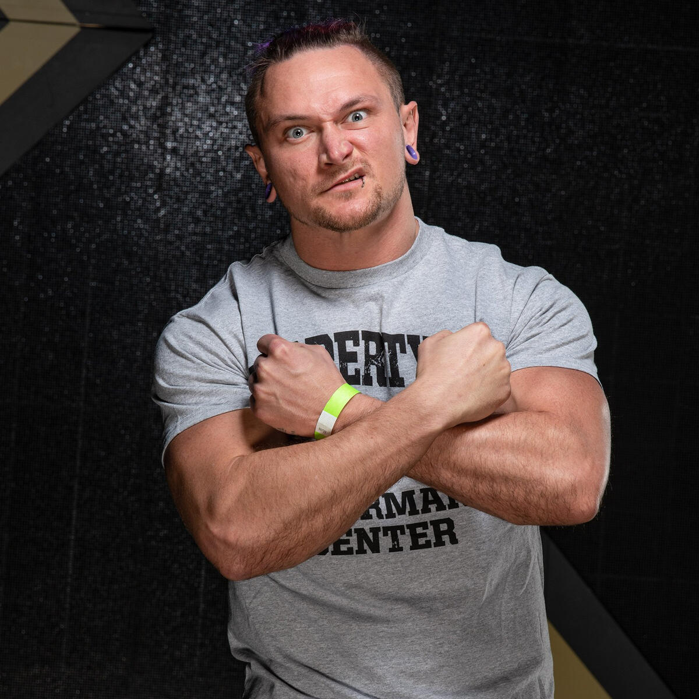
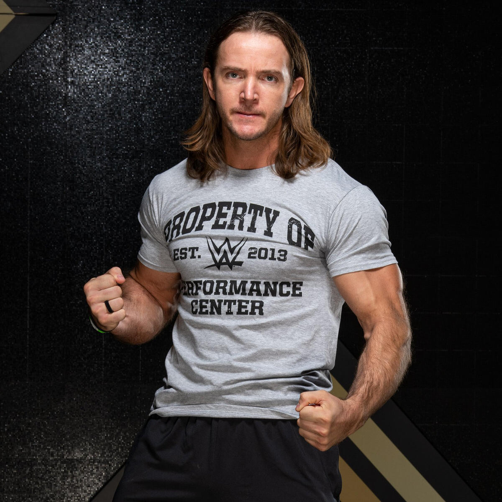

The December 2020 class at the WWE Performance Center held a unique significance. It arrived just before the global pandemic and subsequent budget cuts significantly impacted the company's recruitment. This group, consisting of five seasoned independent wrestlers and a standout basketball player with professional experience, marked a distinct moment in WWE's talent acquisition strategy.

This article delves into the careers of these individual trainees, exploring their trajectories since joining the WWE and their current status within the wrestling industry. Did they stay the course, or did their paths take unexpected turns? Read on to discover their journeys.

--- 

## 🌮 Alex Zayne

**High-flying innovator Alex Zayne has carved a unique path in the world of professional wrestling.** His journey began in 2005, leading him to various independent promotions worldwide. Zayne's technical prowess and captivating in-ring performances earned him a reputation as a top contender, eventually catching the eye of prestigious Japanese promotion New Japan Pro-Wrestling (NJPW). 

**Zayne's impressive NJPW run led to a coveted opportunity with WWE in 2020.** He signed with their developmental brand, NXT, under the ring name "Ari Sterling." While his time with WWE showcased his potential, budget cuts related to the pandemic resulted in his release in 2021.

**Reflecting on his NXT experience with Wrestling Inc., Zayne remained positive.** He praised the locker room, producers, and writers, highlighting the experience as an invaluable learning opportunity. He humorously referred to it as "being paid to go to wrestling Harvard for ten months."

> "Every thing is good. That's why the name thing is frustrating for me because they're on top of their s*** for the most part. Every place and person and thing in the world has its faults, but overall the whole experience was incredibly positive. The locker room was incredible. The producers were awesome. The writers were cool. Everyone was super cool and just trying their best to do whatever they think is best, right? So, the most positive thing for me, on a personal level, would be just that I basically got paid to go to the wrestling Harvard for ten months. That's awesome. Who can argue with that?" 

[Wrestling Inc](https://www.wrestlinginc.com/news/2021/09/alex-zayn-talks-lengthy-wwe-courting-process-his-time-in-nxt/)

**Undeterred by the WWE departure, Zayne returned to his independent roots, thriving in NJPW Strong and other promotions.** He continues to captivate audiences with his signature moves, including the "Cinnamon Twist" and the "Taco Driver." Notably, Zayne has secured an international brand deal with Taco Bell in Japan, featuring the "Alex Zayne Meal." 


Status: **Active (NJPW, GCW, Independents, Taco Bell)**

--- 

## Russ Taylor 

California native Russell Taylor, also known as Tyler Rust, boasts a career spanning over 16 years, starting at the Empire Wrestling Federation (EWF) at a young age of 16. Between 2006 and 2011, Taylor captured multiple championships in EWF, including the Cruiserweight, American, and Heavyweight titles.

While honing his skills in EWF, Rust also caught the attention of WWE during their California events. He faced legends like Big Show in 2008 and teamed with Joey Munoz, facing the formidable Vladimir Kozlov on WWE ECW. Additionally, Taylor participated in a WWE safety awareness campaign commercial.

His commitment to wrestling led to an invitation to a WWE tryout camp in 2012, alongside future WWE stars like Adam Pearce, Timothy Thatcher, and Bayley.

Taylor returned to WWE television in 2019 on Raw, teaming with Randy Taylor in a tag team match.

In December 2020, despite his extensive experience, Taylor (now under the ring name Tyler Rust) was announced as a recruit of the WWE Performance Center. He debuted in NXT as Timothy Thatcher's student and later became part of the Diamond Mine stable. Unfortunately, his time with WWE ended in August 2021 with his release.

After leaving WWE, Rust wrestled his last known match for NJPW STRONG in August 2022, facing BULLET CLUB members Chase Owens, Hikuleo, Jay White, and Juice Robinson.

Status: Inactive

---

## 🇩🇪 Germany

Ikemen Jiro

Status: Active (Independents)

---

## 🇲🇽 Mexico

### Oscar Vasquez Aka Magno (Ciudad Juarez, Mexico) 
Oscar Vasquez trained in Juarez in the lucha libre style of wrestling by Hector Rincon, who was the childhood friend of the late, Eddie Guerrero

Oscar accepted his 2015 WWE Performance Center spot in April and [cagematch.net](https://www.cagematch.net/?id=2&nr=5334&page=4) lists his NXT house show matches in 2015 and 2016.

It's assumed he was released in 2016 based on his match history. He has been performing for Lucha Libre Elite and various independent promotions in the United States in Mexico.

Oscar aka Magno's status in the industry is unknown.  

Status: Unknown (last match documented was from May 5, 2022 for Lucha VaVoom)

---

## 🇷🇸 Serbia

### Radomir Petkovic Aka King Constantine from Belgrade, Serbia 

Radomir was a two-time Greco-Roman and Freestyle bronze medalist at the 2009 Mediterranean Games and also a 2010 European Wrestling Champion. 

He trained with the WWE Performance Center in 2015 and was released a year later.

Status: Inactive

---

## 🇬🇧 United Kingdom

### Peter Howard (Exeter, England)

Peter Howard was a former collegiate Rugby player in the UK. After an injury shortened his career, he pivoted to discus and became a regional champion.

His first tryout was in the U.K. in 2014 which an MMA friend also attended and got him the opportunity.

As of February 2016, he was released from the WWE Performance Center and no other information is available regarding what he's up to today.  

Status: Inactive 

---

## 🇺🇸 United States of America

### Kenneth Crawford Aka Montez Ford (Chicago, Illinois/Anson County, North Carolina) 

Kenneth Crawford aka Montez Ford was a high school athlete holding records in the 200-meter, 400-meter, and 4x4 relay at North Carolina South Piedmont and Anson High School while also named Anson High School Athlete of the Year in 2007. He served in the U.S. Marine Corps from September 2008 - September 2012 and achieved a perfect 300 score in the United States Marine Corps Physical Fitness Test.

Kenneth's tryout came after his wife submitted pictures on the [WWE Recruit website](https://recruit.wwe.com/#!/tryout) in 2013. He earned a spot in the 2015 WWE Performance Center class shortly thereafter.

From 2016-2019, Kenneth Crawford, now going by Montez Ford, gained success tag teaming with Angelo Dawkins. Their tag team would be called the Street Profits.

In late 2019, the Street Profits would be called up to the main roster where they remain today, splitting time with Raw and Smackdown.  

Status: Active (WWE)

---

### Thomas Kingdon (Traverse City, Michigan)

Thomas Kingdon, a former bodybuilder who won the super-heavyweight category at the 2013 NPC Central States Competition, applied for a WWE tryout through the [WWE Recruit website](https://recruit.wwe.com/#!/tryout). He was part of the WWE developmental system until 2016, when he was let go. His current whereabouts and involvement in the wrestling business are unknown.

Status: Inactive

---

### Sesugh Uhaa Aka Apollo Crews (Atlanta, Georgia)

Sesugh Uhaa aka Apollo Crews was a high school standout in soccer, football, and track and field in the state of Georgia. He began his training at the WWA4 wrestling school in 2009 and got his big break with Dragon Gate in 2011. From 2011-2015, he was on their roster and eventually landed a spot with the 2015 WWE Performance Center class.

Apollo Crews was called up to the main roster in 2016 and remained until the summer of 2022, where he now wrestles on the NXT brand.  

Status: Active (WWE)

---

### Levis Valenzuela Jr. (Durham, North Carolina) 

Levis trained with CWF Mid-Atlantic in 2013 and wrestled mostly for them until 2015 when he earned a spot on the 2015 WWE Performance Center class. 

He debuted as No Way Jose on NXT in 2016 and got called up to the main roster in 2018. He was eventually released from the WWE in 2020.

He made a brief apperance with Impact! Wrestling and has been seen on a few independent shows.  

Status: Active (Independents)

--- 

## How did the 2015 WWE Performance Center trainees do?
### Out of 11 performers...
* 3 are active in the WWE
  * 27% of that class are currently active in the WWE
* 6 are inactive or status is unknown
  * 55% of that class are currently not active in the pro wrestling industry
* 2 are active on the independents
  * 18% of that class are currently active outside of WWE

---

## Additional reading:
[WWE image album published in Dec 20202](https://www.wwe.com/shows/wwenxt/gallery/wwe-performance-center-recruits-dec-2020-photos#fid-40512479)
[Cagesideseats article published on Dec 2nd, 2020](https://www.cagesideseats.com/2020/12/2/22149260/rascalz-headline-wwe-performance-center-class-dec-2020)