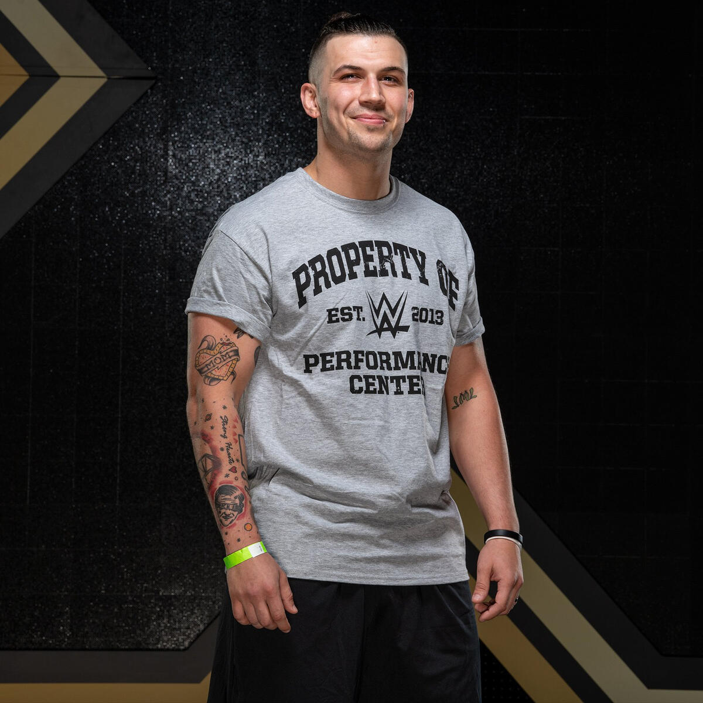

The December 2020 class at the WWE Performance Center held a unique significance. It arrived just before the global pandemic and subsequent budget cuts significantly impacted the company's recruitment. This group, consisting of five seasoned independent wrestlers and a standout basketball player with professional experience, marked a distinct moment in WWE's talent acquisition strategy.

This article delves into the careers of these individual trainees, exploring their trajectories since joining the WWE and their current status within the wrestling industry. Did they stay the course, or did their paths take unexpected turns? Read on to discover their journeys.

--- 

## 🌮 Alex Zayne

High-flying innovator **Alex Zayne** has carved a unique path in the world of professional wrestling. His journey began in 2005, leading him to various independent promotions worldwide. Zayne's technical prowess and captivating in-ring performances earned him a reputation as a top contender, eventually catching the eye of prestigious Japanese promotion New Japan Pro-Wrestling (NJPW). 

Zayne's impressive NJPW run led to a coveted opportunity with WWE in 2020. He signed with their developmental brand, NXT, under the ring name "Ari Sterling." While his time with WWE showcased his potential, budget cuts related to the pandemic resulted in his release in 2021.

Reflecting on his NXT experience with Wrestling Inc., Zayne remained positive. He praised the locker room, producers, and writers, highlighting the experience as an invaluable learning opportunity. He humorously referred to it as "being paid to go to wrestling Harvard for ten months."

> "Every thing is good. That's why the name thing is frustrating for me because they're on top of their s*** for the most part. Every place and person and thing in the world has its faults, but overall the whole experience was incredibly positive. The locker room was incredible. The producers were awesome. The writers were cool. Everyone was super cool and just trying their best to do whatever they think is best, right? So, the most positive thing for me, on a personal level, would be just that I basically got paid to go to the wrestling Harvard for ten months. That's awesome. Who can argue with that?" 

[Wrestling Inc](https://www.wrestlinginc.com/news/2021/09/alex-zayn-talks-lengthy-wwe-courting-process-his-time-in-nxt/)

Undeterred by the WWE departure, Zayne returned to his independent roots, thriving in NJPW Strong and other promotions. He continues to captivate audiences with his signature moves, including the "Cinnamon Twist" and the "Taco Driver." Notably, Zayne has secured an international brand deal with Taco Bell in Japan, featuring the "Alex Zayne Meal." 


Status: **Active (NJPW, GCW, Independents, Taco Bell)**

--- 

## Russ Taylor 

California native Russell Taylor, also known as Tyler Rust, boasts a career spanning over 16 years, starting at the Empire Wrestling Federation (EWF) at a young age of 16. Between 2006 and 2011, Taylor captured multiple championships in EWF, including the Cruiserweight, American, and Heavyweight titles.

While honing his skills in EWF, Rust also caught the attention of WWE during their California events. He faced legends like Big Show in 2008 and teamed with Joey Munoz, facing the formidable Vladimir Kozlov on WWE ECW. Additionally, Taylor participated in a WWE safety awareness campaign commercial.

His commitment to wrestling led to an invitation to a WWE tryout camp in 2012, alongside future WWE stars like Adam Pearce, Timothy Thatcher, and Bayley.

Taylor returned to WWE television in 2019 on Raw, teaming with Randy Taylor in a tag team match.

In December 2020, despite his extensive experience, Taylor (now under the ring name Tyler Rust) was announced as a recruit of the WWE Performance Center. He debuted in NXT as Timothy Thatcher's student and later became part of the Diamond Mine stable. Unfortunately, his time with WWE ended in August 2021 with his release.

After leaving WWE, Rust wrestled his last known match for NJPW STRONG in August 2022, facing BULLET CLUB members Chase Owens, Hikuleo, Jay White, and Juice Robinson.

Status: Inactive

---

## Kuroshio Tokyo Japan (黒潮TOKYOジャパン)

Sojiro Higuchi, better known by his wrestling names Ikemen Jiro and Kuroshio Tokyo Japan, has carved a unique path in the world of professional wrestling. This charismatic competitor has thrilled audiences in Japan, the United States, and beyond with his high-flying style and flamboyant persona.

Higuchi was trained by former United States and WWE Tag Team Champion, Tajiri, and debuted in 2011, quickly establishing himself in Japanese promotions like Smash and Wrestling New Classic. In 2014, he joined Wrestle-1, where he found significant success. He captured the UWA World Trios Championship twice with his stable "Jackets" and even secured a singles victory for the Gaora TV Championship. However, injuries hampered his momentum, and he ultimately left Wrestle-1 in 2019.

**WWE and NXT (2020-2023):**

A new chapter began for Higuchi in 2020 when he signed with WWE and entered the Performance Center. He debuted in 2021 under the name Ikemen Jiro on 205 Live, showcasing his agility and infectious smile. Jiro quickly formed a tag team with Kushida, named "Jacket Time," and participated in the NXT Breakout Tournament and Dusty Rhodes Tag Team Classic. Despite their exciting performances, Jiro was released from WWE in September 2023.



A New Dawn (2023-present):

Jiro hasn't slowed down since his WWE departure. He returned to Japan in October 2023, making a surprise appearance for DDT Pro-Wrestling and securing a victory. He also joined All Japan Pro Wrestling under the ring name Kuroshio Tokyo Japan, teaming with Seigo Tachibana in the prestigious World's Strongest Tag League.



---

## Lash Legend

---

## Zachary Green

---

## Wes Lee

--- 

## How did the 2020 WWE Performance Center trainees do?
### Out of six performers...
* 3 are active in the WWE
  * 27% of that class are currently active in the WWE
* 6 are inactive or status is unknown
  * 55% of that class are currently not active in the pro wrestling industry
* 2 are active on the independents
  * 18% of that class are currently active outside of WWE

---

## Additional reading:
[WWE image album published in Dec 20202](https://www.wwe.com/shows/wwenxt/gallery/wwe-performance-center-recruits-dec-2020-photos#fid-40512479)
[Cagesideseats article published on Dec 2nd, 2020](https://www.cagesideseats.com/2020/12/2/22149260/rascalz-headline-wwe-performance-center-class-dec-2020)