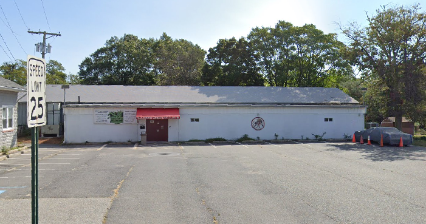
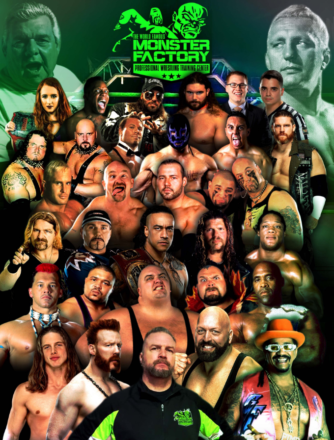

The Monster Factory has been developing talent since its founding in 1983 when "Pretty Boy" Larry Sharpe and "Nature Boy" Buddy Rogers founded the training center. It was bought and rebranded the World Famous Monster Factory in 2011, by Danny Cage, who coaches, owns, and operates the school.

## Where is the World Famous Monster Factory located?
It is located in Paulsboro, New Jersey. The facility is also known as the Paulsboro Wrestling Club.

**Address**

541 Mantua Ave  
Paulsboro, New Jersey 08066

### Close Cities
* Philadelphia, PA
* Wilmington, DE

### Does the World Famous Monster Factory offer housing or dorms for their trainees and students?
 No

--- 

## Who are the World Famous Monster Factory Trainers?
* Danny Cage
* The Blue Meanie
* Billy Wiles
* Q.T. Marshall

## Which pro wrestlers have trained at the World Famous Monster Factory?

* Bam Bam Bigelow
* Barry Hardy
* Paul "Big Show" Wight
* Budlicious
* Chris Candido
* Chris Harris
* Domino
* D'Lo Brown
* Giant Silva
* Gillberg
* The Godfather
* The Headbangers
* King Kong Bundy
* Matt Riddle
* Nick Comoroto
* The Pitbulls
* Damian Priest
* Raven
* Rocco Rock
* Ray Odyssey
* Sheamus
* Sonjay Dutt
* Steve Maclin
* Tank Toland
* Tatanka
* Tony Atlas
* Tony Stetson
* J. T. Southern
* "Virgil" Mike Jones
* Q. T. Marshall

---

## What programs are offered at the World Famous Monster Factory?
The World Famous Monster Factory offers 3 programs:
1. Beginner
2. Advanced
3. Junior

### Beginner Program (One Year)
* Tuesday 8pm - 10pm
* Thursday 8pm - 10pm
* Friday 8pm - 10pm
* Sunday 8 pm - 10pm

Total of 8 hours a week.
### Advanced Program (One Year or Lifetime)
* Monday 8pm - 10pm
* Wednesday 8pm - 10pm
* Sunday 8pm - 10pm (Same time as the Beginner class)

Total of 6 hours a week.

### Junior Program (One Year or Lifetime)
* Saturday - 9am - 10:30am

Total of 1.5 hours a week

> All students can & will train together on various instances. For examples Juniors are allowed to attend all training classes with parent or guardian. Beginners are encouraged to sit in on Advanced classes & Beginners & Advanced train together on Sundays

### What else will the World Famous Monster Factory students learn:
* Production
  * Writing
  * Formatting
* Referee
* Manager
* Social Media
* Commentary

---

## How much does it cost to train at the World Famous Monster Factory?
They offer 2 options to pay for the Beginner, Advanced and Junior programs.

### One Year Membership Paid in Full (Juniors)
* $1,246.44 USD Total
  * $1,200 USD plus a $46.44 fee
### One Year Membership with payment plan (Juniors)
* $1,621.53 USD Total
  * $400 USD plus a $21.31 fee
    * $400 down
    * $400 x 4 spaced out over the year of training

#### Membership Breakdown
Price includes the use of the weight room and additional training services (production, referee, etc).

Paying in full will save you 23%. Calculation below is assuming you attend every class in one year.

#### Price per class (One Year)
* Juniors Training (1 day/week)
  * **$23.97** a class if you paid in full 
  * **$31.18** a class if you are on the payment plan

---

### One Year Membership Paid in Full (Adults)
* $2,021.23 USD Total
  * $2,000 USD plus a $21.31 fee
### One Year Membership with payment plan (Adults)
* $2,525.53 USD Total
  * $2,500 USD plus a $25.53 fee
    * $500 down
    * $500 x 4 spaced out over the year of training

#### Membership Breakdown
Price includes the use of the weight room and additional training services (production, referee, etc).

Paying in full will save you 20%. Calculation below is assuming you attend every class in one year.

#### Price per class (One Year)
* Beginner Training (4 days/week)
  * **$9.72** a class if you paid in full 
  * **$12.14** a class if you are on the payment plan

* Advanced Training (3 days/week)
  * **$12.96** a class if you paid in full 
  * **$16.19** a class if you are on the payment plan

---

### Lifetime Membership Paid in Full (Adults + Juniors)
* $5,674.86 USD Total
  * $5,500 USD plus a $174.86 fee
### Lifetime Membership with payment plan (Adults + Juniors)
* $7,025.53 USD Total
  * $7,000 USD plus a $25.53 fee
    * $500 down
    * $500 x 13

#### Membership Breakdown
Price includes the use of the weight room and additional training services (production, referee, etc).

Paying in full will save you 19.2%. 

---

## What other amenities are available at the World Famous Monster Factory?
* Weight Room

---

## Who can I contact?

[The World Famous Monster Factory](https://www.monsterfactory.org/training-at-the-monster-factory/)

**Danny Cage**  
Phone: (609) 471-7904  
Email: monsterfactorytv@gmail.com


