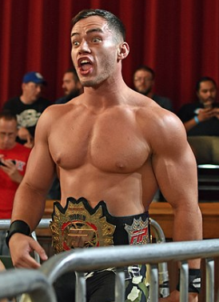
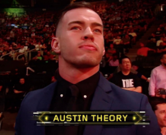
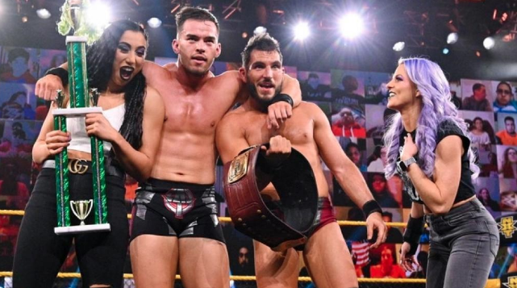
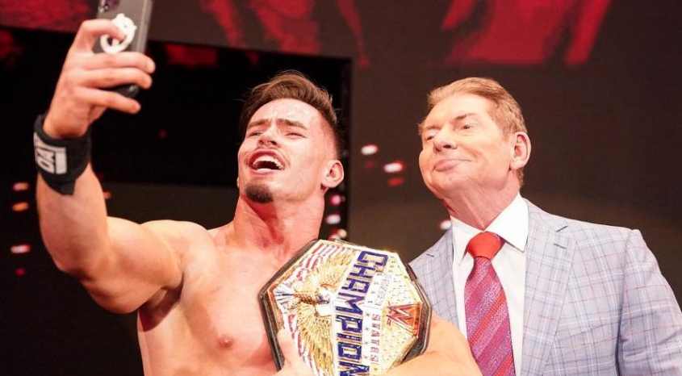
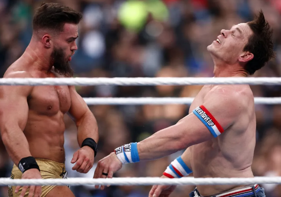

## Athletic Background
Austin Theory was involved with bodybuilding before he started training as a Professional Wrestler.

---

## 2016 
### Austin Theory makes his Pro Wrestling Debut

He began his wrestling career at a young age and trained at the World Wrestling Alliance 4 (WWA4) wrestling school in Atlanta, Georgia. In 2016, Theory made his debut in the wrestling promotion Evolve, where he gained attention for his impressive athleticism and charisma. He quickly rose through the ranks and became one of the top prospects in the independent wrestling scene. Theory also competed in other prominent wrestling promotions such as Full Impact Pro (FIP), World Wrestling Network, and Pro Wrestling Guerrilla (PWG).

---

## 2019
### Austin Theory signs with the WWE three years after his debut

It took three years to get noticed and in 2019, Theory signed with the WWE and joined the NXT brand (WWE's developmental territory). He made his NXT debut in September of 2019, wrestling at NXT house shows, and gained recognition for his in-ring skills and confident persona. Theory had notable matches against established NXT stars and was praised for his potential as a future star in WWE.

---

## 2020
### Austin Theory makes WWE main roster debut then sent back to NXT for additional training

In 2020, Theory was promoted to the main roster for WWE's RAW in March where he tagged with Angel Garza & Seth Rollins losing to Kevin Owens & The Street Profits. He would remain on RAW until June 2020 when WWE sent him back to NXT for additional training.

---

## 2021 
### Austin Theory resurfaces on the main roster for both RAW and Smackdown

He became a member of the wrestling stable "The Way" on WWE's weekly television show, NXT. Starting July 2021 to September 2021, Austin Theory was appearing on Smackdown dark matches to gain more experience in front of an audience. He would wrestle full time with RAW starting Oct 2021 and occasionally Smackdown.

---

## 2022
### Austin Theory becomes the WWE United States Champion

Austin Theory captures the United States champion on Nov 26, 2022 at Survivor Series by defeating Bobby Lashley and Seth Rollins. As of this writing, he is still the reigning WWE US Champion.

---

## 2023
### Austin Theory pins his childhood hero, John Cena

Austin Theory battles his childhood hero, John Cena, at Wrestlemania 39 at Sofi Stadium in Los Angeles, California. He pinned John Cena in the opening match of Night 1 and retained his United States title.

---

