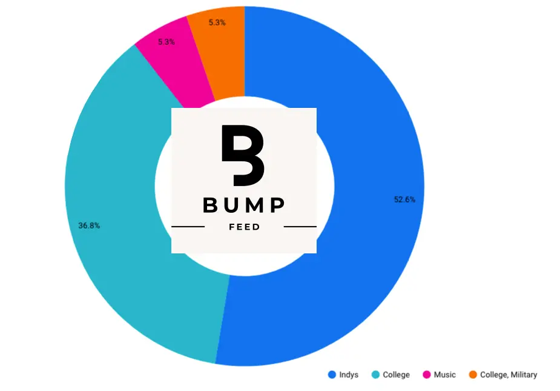
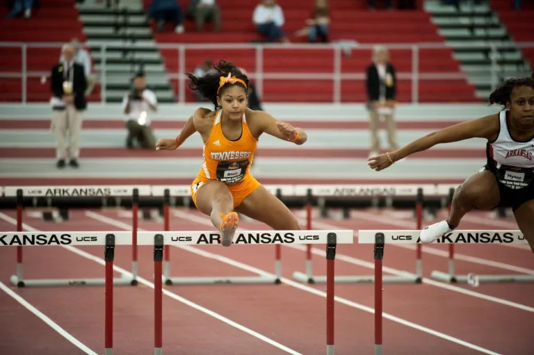
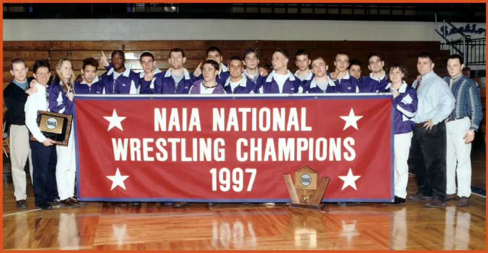
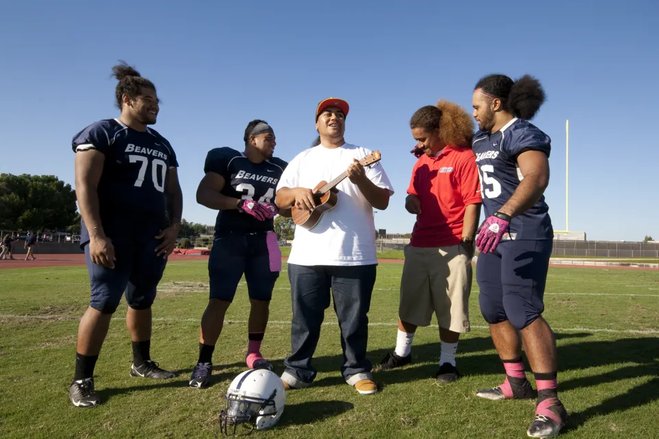
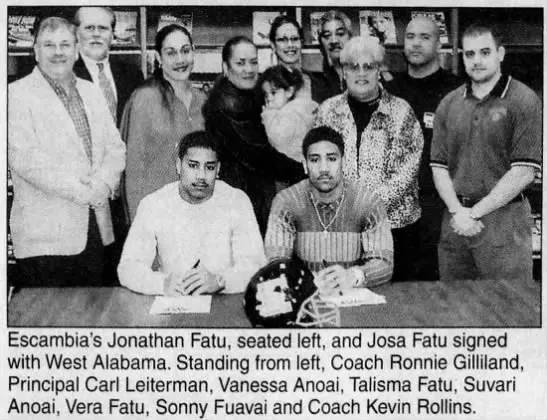
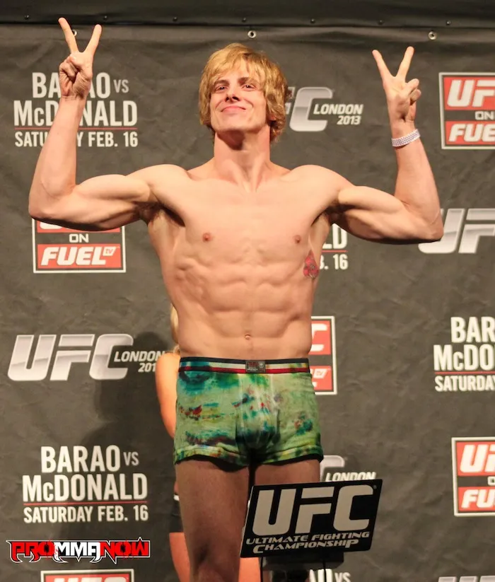
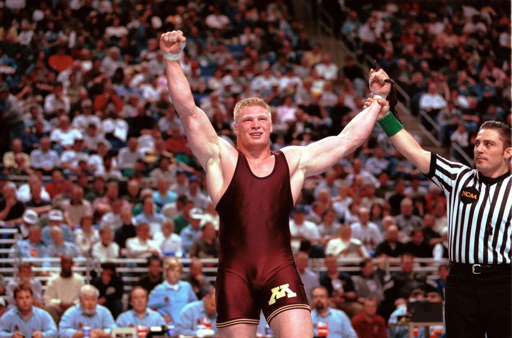

The 2023 Backlash, held in Puerto Rico, was an action-packed WWE event featuring Bad Bunny in a thrilling San Juan Street Fight. Cody Rhodes emerged victorious in the final match, while other standout moments included The Bloodline's triumph and Bianca Belair's record-breaking title defense. Fans and critics alike praised the event, highlighting the memorable San Juan Street Fight and the Raw Women's Championship match. #WWE #Backlash2023

---

_WWE Backlash 2023 Results_
1. Bianca Belair (c) defeated Iyo Sky to retain the WWE Raw Women's Championship in a singles match that lasted 18 minutes.

2. Seth "Freakin" Rollins defeated Omos (with MVP) in a singles match, securing the victory with a pinfall after 10 minutes and 30 seconds.

3. Austin Theory (c) emerged victorious in a triple threat match for the WWE United States Championship against Bobby Lashley and Bronson Reed, winning by pinfall in a match that lasted 6 minutes and 50 seconds.

4. Rhea Ripley (c) retained the WWE SmackDown Women's Championship by defeating Zelina Vega in a singles match, with Ripley securing the win via pinfall after 7 minutes and 10 seconds.

5. Bad Bunny triumphed over Damian Priest in a highly-anticipated San Juan Street Fight, achieving victory via pinfall after an intense 25-minute encounter.

6. The Bloodline, consisting of Solo Sikoa, Jey Uso, and Jimmy Uso, emerged triumphant in a six-man tag team match against Matt Riddle, Kevin Owens, and Sami Zayn. The match concluded with The Bloodline securing the pinfall victory after an action-packed 22 minutes.

7. In a singles match, Cody Rhodes defeated Brock Lesnar by pinfall after a competitive battle lasting 9 minutes and 40 seconds.

_Please note that (c) denotes the reigning champion(s) at the time of the match._

---

There were a total of 19 professional wrestlers that performed on the WWE premium live event that had different backgrounds before joining the main roster. 

## Superstars who played college sports before joining WWE
**42%** of the performers (8 out of 19) from WWE Backlash 2023 had collegiate backgrounds.  
_Bobby Lashley is represented in the chart above as someone who played college sports and was in the military._

### Bianca Belair (Track and Field for the University of South Carolina Gamecocks, Texas A&M Aggies, and the University of Tennessee Volunteers)
 

Bianca Belair, the WWE superstar with serious athletic prowess, had a total blast tearing it up in college! She rocked the tracks at the University of South Carolina, Texas A&M, and the University of Tennessee, dominating in Track & Field and CrossFit. Let me tell you, this gal wasn't messing around. She sprinted, jumped, and lifted her way to the top, leaving her competitors in awe. And when it came to CrossFit, she unleashed her inner beast, pushing herself to the limit and conquering the toughest challenges. It's no wonder she's now a force to be reckoned with in the WWE. Bianca's college athletic career was just the warm-up for the incredible journey she's on now, smashing opponents with her insane strength, agility, and infectious charisma. Talk about a powerhouse! Bianca Belair is proof that college dreams can turn into professional wrestling gold!

### Omos (Basketball for the University of South Florida Bulls and the Morgan State University Bears)

In his college basketball career, Omos showcased his skills at South Florida and Morgan State University. During the 2012-2013 season at South Florida, he played in 24 games, starting 3, and averaged 5.6 minutes per game. Omos had a field goal percentage of .471, with 0.3 made field goals out of 0.7 attempts. He also contributed 0.5 rebounds and 0.2 blocks per game. In the following seasons, Omos continued to make an impact on the court, displaying impressive shooting percentages and defensive prowess. Overall, Omos played a total of 43 games, averaging 4.4 minutes per game and leaving a lasting impression with his physical presence and solid contributions.

### Bobby Lashley (Wrestling at Missouri Valley College)

Bobby Lashley's collegiate wrestling career began at Missouri Valley College, where he showcased exceptional talent and dedication to his craft. As a standout athlete, he quickly made a name for himself with his raw power, technical prowess, and unwavering determination. Lashley's commitment to the sport propelled him to great heights, setting the stage for his future success in the WWE.

In addition to his college wrestling journey, Lashley's path to greatness took a unique turn through his involvement with the Army World Class Athlete Program. This military training not only strengthened his physical abilities but also instilled discipline, mental resilience, and a relentless work ethic. Combining his military training with his wrestling expertise, Lashley emerged as a force to be reckoned with in the world of sports entertainment.

### Solo Sikoa (Football at American River College and Dickinson State College)

Solo Sikoa played for American River College and then transferred to Dickinson State College.

### Jey and Jimmy Uso (Football at the University of West Alabama)

Contrary to previous misconceptions, the Usos attended and excelled at the University of West Alabama, not the University of Hawaii as mistakenly stated. Jonathan, known as Jimmy Uso, played one season for the Tigers in 2003, while his twin brother, Josh (Jules/Jey Uso), joined the team from 2003 to 2005. Though Josh sat out the 2004 season due to academic reasons, he returned to the field with high hopes for the 2005 season.

Despite their initial aspirations in football, the Fatu brothers realized that their football careers were not progressing as desired. Following in the footsteps of their father Solofa (Rikishi) and uncle Eddie (Umaga), they decided to embark on a career in professional wrestling. Under the tutelage of their great-uncle Afa Anoa'i at the Wild Samoan Training Facility, they honed their skills and debuted as a tag team in 2007 at a World Xtreme Wrestling (WXW) show.

The Fatu and Anoa'i family have a long-standing connection with wrestling, making WXW a significant stepping stone for the Usos. Their uncle Eddie and cousin Matt Anoa'i had previously debuted as a tag team in the same promotion. Additionally, Afa Anoa'i's Wild Samoan Pro Wrestling Training Center in Allentown, Pennsylvania, holds special significance for the family. Afa's legacy as one-half of the renowned Wild Samoans tag team contributed to their wrestling heritage.

### Matt Riddle (Wrestling at East Stroudsburg University)

Matt Riddle wrestled one season for East Stroudsburg University and had his scholarship taken away when his coach was fired. He quickly pivoted to Mixed Martial Arts before becoming a sports entertainer.

### Brock Lesnar (Wrestling at the University of Minnesota)

Brock Lesnar attended the University of Minnesota, where he made an indelible mark on the collegiate wrestling scene. Competing in the heavyweight division, Lesnar showcased his extraordinary strength, agility, and technical prowess, cementing his status as one of the most dominant wrestlers of his time.

During his time at Minnesota, Lesnar secured multiple notable championships, solidifying his legacy as a wrestling prodigy. He claimed the NCAA Division I Heavyweight Championship in 2000 and 2002, asserting his dominance over his opponents and becoming a two-time national champion. Lesnar's remarkable performances in these championship runs showcased his exceptional skill set and unyielding drive to succeed.

---

The WWE Backlash 2023 event featured a diverse group of professional wrestlers with varied backgrounds. Among them, several superstars had notable college sports experience. These wrestlers' college backgrounds contributed to their development as athletes and set the stage for their successful careers in WWE. Stay tuned for part 2 of the Superstars Background Breakdown where we look at the careers of the other WWE Backlash 2023 performers.