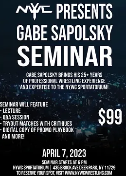

## Where is the NYWC Training Academy located?
It is in Long Island located in Deer Park, New York.

**Address**  
435-13 Brook Ave  
Deer Park, NY 11729  

The major cities around Deer Park, New York and accessible by public transportation are the cities of New York, Long Island City, Babylon, Huntington, and Bay Shore.

You can get to 435-13 Brook Ave, Deer Park NY from these cities by taking the S54 bus from the MTA Bus Company. The approximate travel time from each of the above-mentioned cities is as follows:

New York: **2 hours**  
Long Island City: **40 minutes**  
Babylon: **45 minutes**    
Huntington: **30 minutes**  
Bay Shore: **25 minutes**

### Does the NYWC Training Academy offer housing or dorms for their trainees and students?
No

---

## Who are the NYWC Training Academy Trainers?
### Mike Mondo
Mike Mondo is a professional wrestler, who has been competing in the ring since 2007. He is best known for his time in the independent circuit, where he has held multiple championships. He is also a former member of the WWE, where he competed under the ring name Mike Mondo and was a part of the Spirit Squad. Since then, he has gone on to compete in several promotions, including Ring of Honor, Chikara, and Pro Wrestling Guerrilla. He is also the current champion of AAW Heavyweight Championship, where he has held the title since 2021. Mike is known for his technical prowess and in-ring psychology, which has earned him the respect of fans and peers alike. He is also a very experienced competitor, having competed in high profile matches against some of the top wrestlers in the world. As a wrestler, Mike Mondo is a force to be reckoned with, and his passion and dedication to the sport of professional wrestling is evident in every match he competes in.

### Michael Mistretta
Michael Mistretta has wrestled for many promotions, including World Wrestling Entertainment (WWE), All Elite Wrestling (AEW), Pro Wrestling Guerilla (PWG), Total Nonstop Action (TNA), Ring of Honor (ROH), and Beyond Wrestling. He is a frequent guest on various wrestling podcasts and is a constant presence on the wrestling scene.

## Which pro wrestlers have trained at the NYWC Training Academy?

* Zack Ryder/Matt Cardona
* Curt Hawkins/Brian Myers
* Trent Baretta
* Mike Mondo
* Tony Nese
* John Silver
* Alex Reynolds
* Willow Nightingale
* Alex Coughlin
* Ashley Massarro
* Reby Sky

---

## What programs are offered at the NYWC Training Academy?
The NYWC Training Academy offers 3 programs:
1. Basic
2. Advanced

### Basic Program
* Sunday 1:30pm - 5pm
* Tuesday 6pm - 10pm
* Thursday 6pm - 10pm

Total of 11.5 hours a week.
>Training takes place on Tuesday and Thursday evenings from 6pm-10pm and Sundays from 1:30pm-5pm. Once a student becomes advanced they are eligible to train during off hours.

---

## How much does it cost to train at the NYWC Training Academy?
It costs $200 a month to train.

### Price breakdown
Per week, you're looking at $46.03 a week to have enough to pay the $200/month fee.
You will train 11.5 hours a week (see hours above).
  - There are 4.34524 weeks in a month
  

  - You'll train 49.97 hours OR 49 hours and 58 min a month
  - $200/month % 49.97 hours = $4.0024... an hour
  - 11.5 hours a week x $4.0024 an hour = $46.03 a week
---

## What other programs are available at the NYWC Training Academy?
They regularly hold seminars and tryouts. Gabe Sapolsky, who currently works with the WWE as of this writing, held a seminar on April 7, 2023 to give a lecture, participate in a Q&A session, give critiques for tryout matches, and more. The cost was $99.

---

## Who can I contact for more information regarding the NYWC Training Academy?

[The NYWC Training Academy](https://www.nywcwrestling.com/training-academy)  
Phone: (631) 667-6992   
Email: NYWCSALES@AOL.COM


