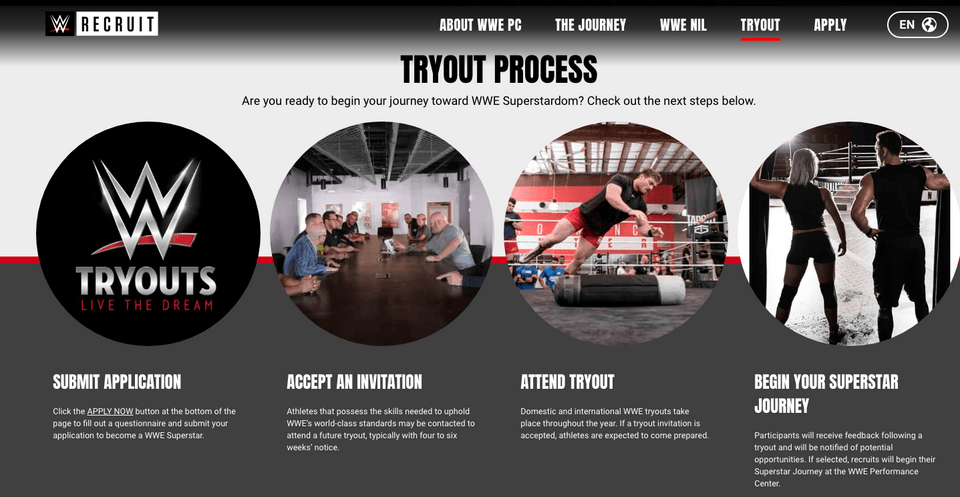
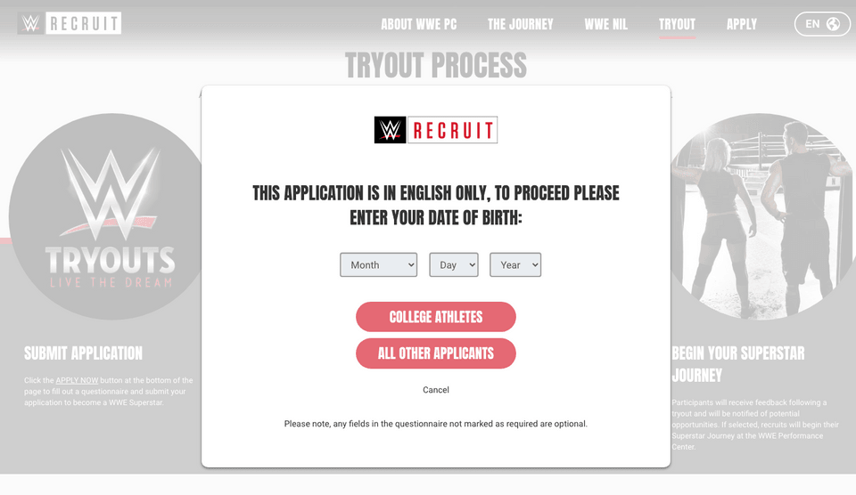
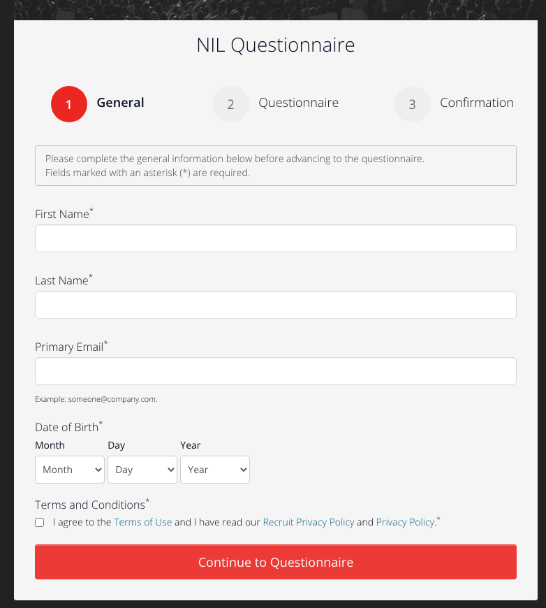
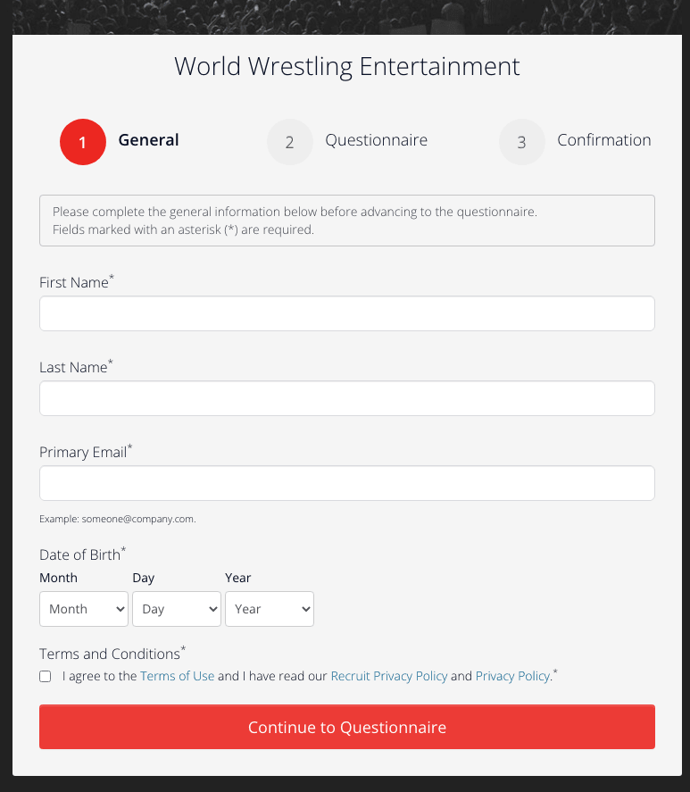

So you want to be a pro wrestler / sports entertainer for the biggest wrestling company in the world? They actually made it easy for you to join and train at the world famous "PC", aka the WWE Performance Center, located in Orlando, Florida. WWE (World Wrestling Entertainment) is constantly looking for fresh talent and even created a website to make the process easier. Scroll down to learn more!

## Step 1 
### Apply and submit your application to be a WWE Sports Entertainer/Pro Wrestler
As of Friday, December 30, 2022, WWE's Recruit website is live and accepting applications. Click the "APPLY NOW" link as seen in the screenshot, or scroll down to get started! The pop-up/modal asks for your date of birth and if you are a college athlete or not.

#### If you are a college athlete, you will be taken to an NIL questionnaire

#### If you are NOT a college athlete, you will be taken to the general questionnaire

## Step 2
### Accept an invitation from WWE
After submitting your application, WWE may contact you within 4-6 weeks notice to attend a tryout. In the meantime keep working in the ring and practicing your craft.

## Step 3
### Attend a tryout
WWE is known to hold tryouts when there are RAW and Smackdown tv tapings and at major PLEs (Premium Live Events) throughout the year. Set an alert for tv tapings and PLE events happening near you. 


The above tweet shows a tryout during Wrestlmania weekend in Los Angeles, California.

## Step 4
### Wait for feedback from the WWE Performance Center
Contracts can be given on the spot during WWE tryouts or through additional evaluation. If they see something in you, WWE will contact you to start your journey.

---

Visit the WWE Recruiting website here 👉 [WWE Recruit](https://recruit.wwe.com/#!/tryout)

Good luck!

---

