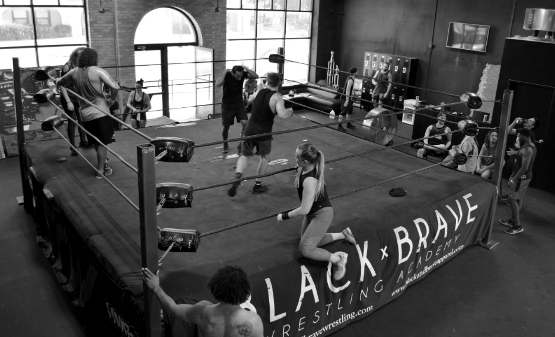

## Where is Seth Rollins' Black x Brave Wrestling Academy located?
It is located in Davenport, Iowa. 

### Which major cities are near the Black x Brave Wrestling Academy located in Davenport, Iowa?

1. Chicago, Illinois - Davenport is approximately 180 miles west of Chicago, and there are several options for public transportation between the two cities. Amtrak's California Zephyr route runs between Davenport and Chicago's Union Station, with a travel time of approximately 3.5 to 4 hours. Greyhound also operates buses between the two cities, with a travel time of approximately 3 to 4 hours.

2. Des Moines, Iowa - Des Moines is located approximately 160 miles west of Davenport, and can be reached via Greyhound or Burlington Trailways bus service, with a travel time of approximately 3.5 to 4 hours.

3. Minneapolis, Minnesota - Minneapolis is located approximately 300 miles north of Davenport, and can be reached via Greyhound or Jefferson Lines bus service, with a travel time of approximately 6 to 7 hours.

4. Kansas City, Missouri - Kansas City is located approximately 250 miles southwest of Davenport, and can be reached via Greyhound or Burlington Trailways bus service, with a travel time of approximately 5.5 to 6.5 hours.

5. St. Louis, Missouri - St. Louis is located approximately 300 miles south of Davenport, and can be reached via Greyhound or Burlington Trailways bus service, with a travel time of approximately 6.5 to 7.5 hours. Amtrak's Southwest Chief route also runs between the two cities, with a travel time of approximately 8.5 to 9.5 hours.

### Does the Black x Brave Wrestling Academy offer housing/lodging for their trainees and students?
Yes! Students can rent bunks for $300 a month.

--- 

## Who are the Black x Brave Wrestling Academy Trainers?
* Seth Rollins
* Marek Brave
* Matt Mayday

## Which pro wrestlers have trained at the Black x Brave Wrestling Academy?
* Nathan Frazer 
* Zicky Dice
* Frontman Jah

---

## What programs are offered at the Black x Brave Wrestling Academy?
They offer a 12 week program open to Men and Women, over the age of 18, to learn pro wrestling and also have access to open ring times and unlimited access to QC Crossfit training.  
Students will also have the opportunity to help at local independent promotions, which will pay off 100x in networking alone, while also learning the behind the scenes of a show.

### When does the next Black x Brave Wrestling academy training start?
The dates listed on their website starts with 2024 but we encourage you to contact the academy if you plan on training this year (2023) in case there were some last minute cancellations.

#### 2024
* January 3rd, 2024
* May 1st, 2024
* September 4th, 2024

#### 2025
* January 8th, 2025
* May 7th, 2025
* September 3rd, 2025

### 12 Week Program days and hours for training
* Tuesday 11am - 2pm
* Wednesday 11am - 2pm
* Thursday 11am - 2pm

*Students will have the opportunity to travel to independent promotions on the weekends

---

## How much does it cost to train at the Black x Brave Wrestling Academy?
_From the Black x Brave website:_
>Please be aware that tuition cost is rising in 2025 to a total of $4,000. As a result, your down payment will be $2,000.

### 12 Week Training (No Lodging)
* $3,500 USD Total
  * $1,750 USD within 30 days of acceptance
  * $1,750 USD within night 1 of training

### 12 Week Training (Including Lodging)
* $4,400 USD Total
  * $3,500 USD Total for training
    * $1,750 USD within 30 days of acceptance
    * $1,750 USD within night 1 of training
  * $900 for lodging
    * $300 x 3 months

#### Price Breakdown
Price includes the use of the gym equipment at the facility, unlimited access to QC Crossfit training ($500 value), and access to ring times.

#### Price per class (No Lodging)
* 12 Week Training (3 day/week)
  * **$97.22** a class if you paid in full 

#### Price per class (Including Lodging)
* 12 Week Training (3 day/week)
  * **$122.22** a class if you paid in full  

---

## What equipment and/or other services are available at the Black x Brave Wrestling Academy?
* WWE ring
* Gym equipment
* Crossfit training
* Personal training outside of normal class hours

---

## How do I contact the Black x Brave Wrestling Academy?

[Sign up for Black x Brave Wrestling Academy on their website](https://www.blackandbravewrestling.com/new-page)

Sheamus recently did a Celtic Warrior workout with Seth Rollins and Becky Lynch at the Black x Brave Academy. Watch the video below.

