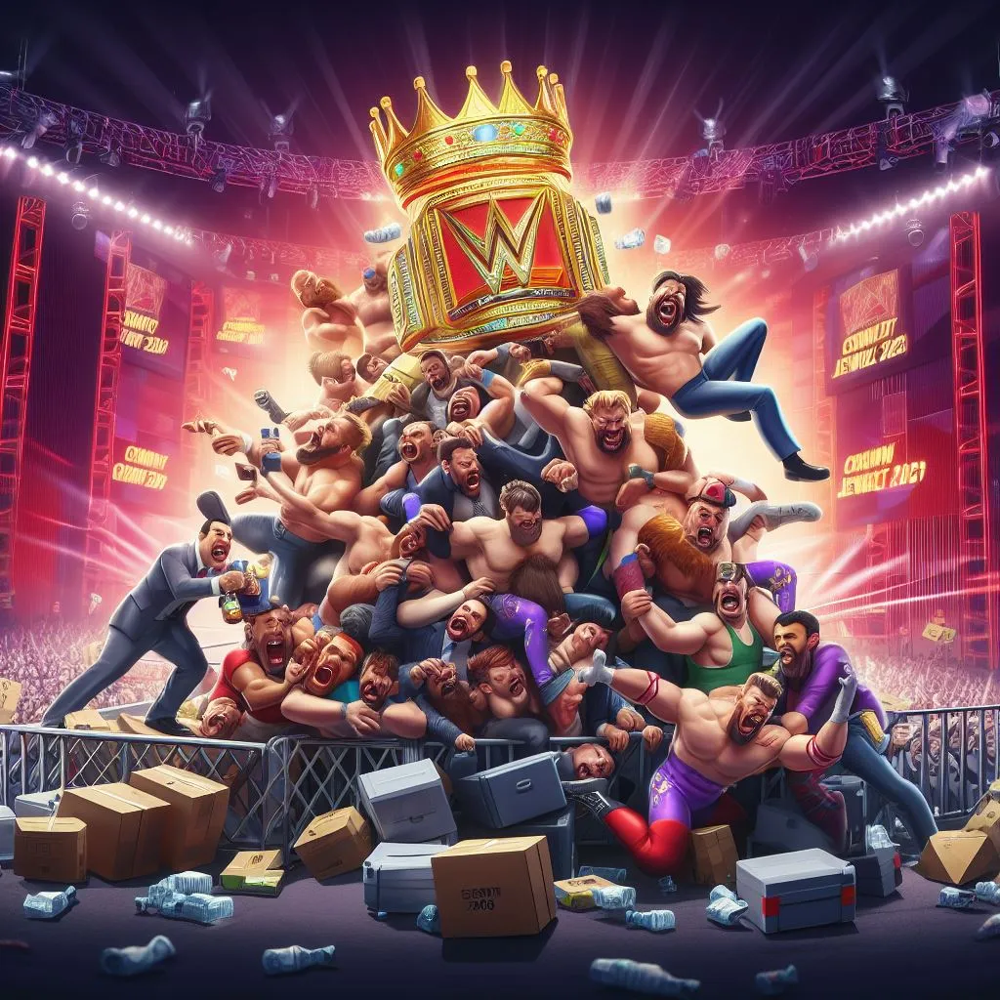
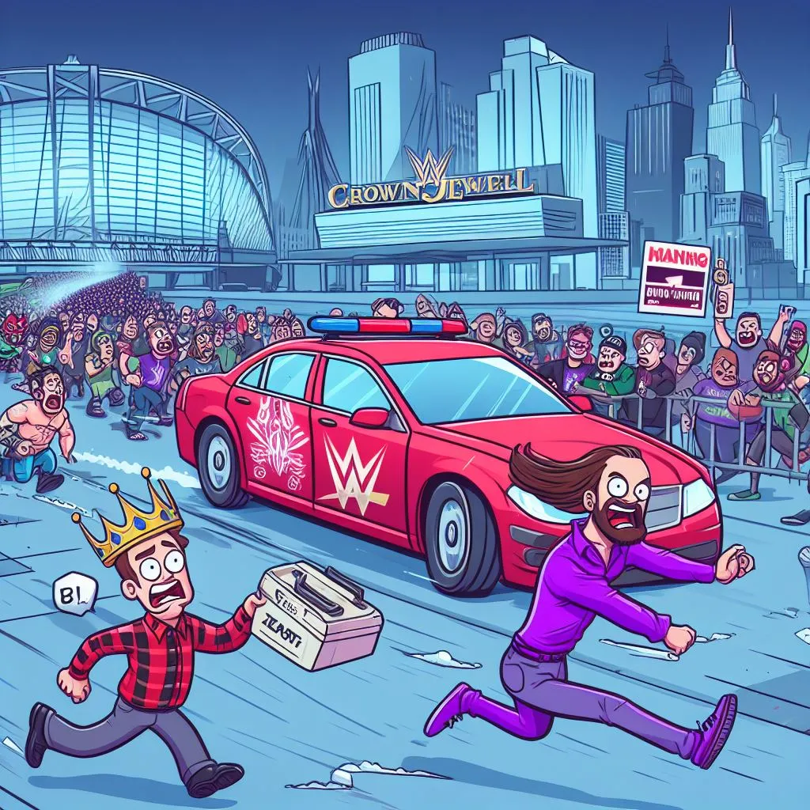

# WWE Crown Jewel 2023: The Best and Worst Matches to Watch

## Decoding the Match Quality Index (MQI): Navigating the Realm of WWE's Must-See Encounters

In the captivating universe of professional wrestling, where athleticism, storytelling, and raw emotion intertwine, determining the true quality of a match can be a subjective endeavor. However, with the introduction of the [Match Quality Index (MQI)]( "Match Quality Index (MQI)"), a data-driven approach has emerged to objectively evaluate the factors that contribute to an exceptional wrestling spectacle.

The MQI takes into account three key metrics: match rating, match duration, and WON rating. Match rating reflects the overall sentiment of fans, while match duration highlights the intensity and endurance displayed by the wrestlers. WON rating, provided by the esteemed Wrestling Observer Newsletter, adds a layer of expert evaluation.

Navigating the WWE Landscape: Must-See Encounters and Ones to Skip

By analyzing the MQI scores of recent WWE matches, we can identify the encounters that are most likely to deliver an unforgettable viewing experience for wrestling fans.

## Matches to Watch: Unmissable Encounters

### WWE World Heavyweight Title Match: Seth Rollins (c) defeats Drew McIntyre (18:24) (MQI: 7.54)
This enthralling title defense by Seth Rollins against Drew McIntyre showcased both wrestlers' technical prowess and captivating storytelling. Strategic sequences and an unpredictable outcome kept the audience engaged throughout.

### Singles Match: Solo Sikoa defeats John Cena (16:10) (MQI: 6.78)
While the overall MQI score for this match might not be the highest, it was a well-executed and entertaining encounter that highlighted the athleticism and power of both wrestlers. The match featured several memorable moments, including a surprising pinfall victory by Solo Sikoa.

### Singles Match: Cody Rhodes defeats Damian Priest (11:04) (MQI: 6.55)
This match showcased the high-flying aerial maneuvers and technical skills of both Cody Rhodes and Damian Priest. The fast-paced action and intense rivalry between the two wrestlers kept the audience on the edge of their seats.

### WWE Title / WWE Universal Title Match: Roman Reigns (w/Paul Heyman) (c) defeats LA Knight (20:03) (MQI: 7.71)
The highly anticipated main event match delivered the hard-hitting action that fans expected. Reigns' dominance and LA Knight's underdog spirit made for an exciting and unpredictable encounter.

## Encounters to Consider Skipping

### WWE Women's World Title Fatal Five Way Match: Rhea Ripley (c) defeats Nia Jax and Raquel Rodriguez and Shayna Baszler and Zoey Stark (11:05) (MQI: 6.41)
While featuring several talented wrestlers, the chaotic nature of the Fatal Five Way format made it difficult for any one wrestler to shine through. The match lacked a clear storyline and a memorable outcome.

### WWE Women's Title Match: IYO SKY (c) defeats Bianca Belair (16:33) (MQI: 6.36)
This match had a solid technical execution, but it lacked the storytelling depth and emotional connection that make for a truly memorable encounter. The outcome was predictable, and the match didn't advance any significant storylines.

## Conclusion
WWE Crown Jewel 2023 was a great event that had some amazing matches. However, not all matches were worth your time, and some of them were better off skipped. We hope that this blog post helped you decide which matches to watch and which ones to avoid, based on the MQI metric. If you enjoyed this blog post, please share it with your friends and leave a comment below or on socials. Thanks for reading!